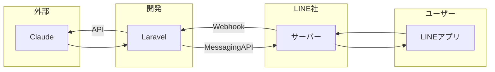
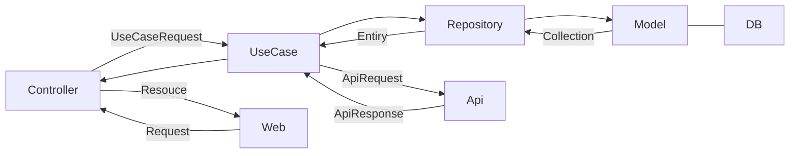

# laravel-line-handson-2024

本リポジトリは下記ハンズオンイベントで利用するソースコードです

https://linedevelopercommunity.connpass.com/event/313579/

## 推奨環境

- VSCode
  - Dev Container

> 上記以外の環境はサポート対象外です

## 実行

### インストール & コンテナ起動

```bash
make
```

> make は下記のエイリアスです
>
> ```
> make install
> make down
> make copy-env-if-not-exist
> make up
> ```

### インストールのみ

```bash
make install
```

### .env 生成

```bash
make copy-env-if-not-exist
```

### コンテナ起動

```bash
make up
```

### コンテナ終了

```bash
make down
```

## Dev Container

コンテナ起動後に

### 操作イメージ

<details>

<summary>クリックして表示</summary>


> `Container ~~~` と表示されていれば OK

</details>

## 全体像



## 依存関係


